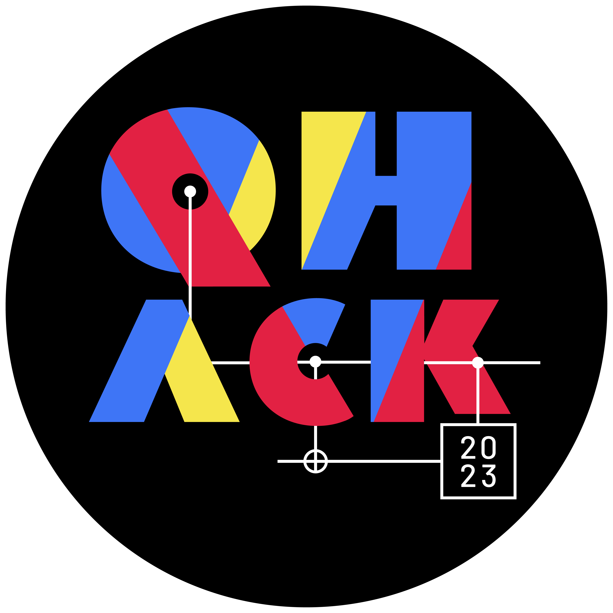
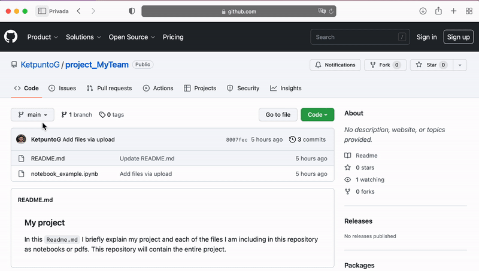

## QHack Open Hackathon

Share your ideas with the quantum world at QHack's famous open hackathon!

This year's hackathon includes new sponsored challenges, each with unique prizes. You can submit your project to multiple prizes as long as it is eligible for them.

See below for challenge topics and additional eligibility criteria. Complete details for prize eligibility is available in the [2023 QHack Terms & Conditions](https://qhack.ai/terms-and-conditions/).

---

### How do I take part?

To submit your team's entry for any of these prizes, you should follow these steps:

1. Create a repository with your project.

2. Create an issue in this repository following this [template](https://github.com/XanaduAI/QHack2023/issues/4).

3. If you are applying for a power-up, indicate this by adding the `PowerUp` label to the issue you created in step 2.

4. If, on the other hand, you are submitting your work for the final project — _not_ a power-up — you must add the `Done` label to the issue created in step 2. If you submitted your work previously for a power-up, create a new issue for your final project submission — do not reuse the power-up submission.

In the template you will be asked to add a link to your repository. In this case, instead of sending a link to the `main` branch, **you should send the link to the commit at that time**. 
Here, I share with you a gif in which we can see how to link to the last commit.

Once you are showing the files associated with the commit, copy the link that appears above in the browser.

And that's it — as easy as that! 

---

### What hackathon project should my team do?

The QHack Open Hackathon is open-ended. The choice of topic is completely up to you! 
You could brainstorm a new idea with your team, or start from one of the following seed ideas:

- Implement an idea from the quantum literature — or from one of our guest speaker presentations — with code.

- Create a self-contained tutorial or demonstration of an idea from quantum computing. See the [PennyLane Community page](https://pennylane.ai/qml/demos_community.html) to see what we're looking for!

- Extend one of the QHack Coding Challenges in a novel or interesting way.

- Repurpose one of the [PennyLane demos](https://pennylane.ai/qml/demonstrations.html) to run on a quantum hardware device.

- Submit a Pull Request to an open-source library with a new feature.

All entries are subject to the QHack [Terms & Conditions](https://qhack.ai/terms-and-conditions/).

---

### Power Ups

Details about power-ups will be announced soon!

---

### Timeline

- **February 21**: The hackathon has not yet started but a power-up will be given to those teams with the best scores in the coding challenges (details to be confirmed).

- **February 22**: Hackathon topics are announced! Time to get to work.

- **February 23**: If you want to get a power up don't forget to make a partial submission with the `PowerUp` label. At 5PM ET we will no longer accept submissions for powerups.

- **February 24**: The teams that have uploaded the best projects will receive the power ups.

- **February 28**: Time is up! The deadline is 5pm ET, so make sure you have everything ready in advance to avoid last minute problems.
---
### Hackathon Prizes

_Details for each Hackathon topic will be released on February 22, 10am ET._

---
#### Visualization Challenge

**First Prize**:

Sponsored by:
[Atom Computing](https://atom-computing.com)

- One-person two-part trip. 
  - Part 1: Office in Berkeley, California, USA to meet their  team. 
  - Part 2: Office in Boulder to meet their team and tour the facility.
- Paid Expenses: Flight and accommodation

**Second Prize**:

Sponsored by:
[Rigetti](https://www.rigetti.com)

- Early access to Ankaa™, Rigetti’s fourth generation 84-qubit system available in Q3 2023.
- Up to four sets of Apple® AirPods®.

**Third Prize**:

Sponsored by:
[Strangeworks](https://strangeworks.com)

- One year software license to the Strangeworks Enterprise level product with USD $3,000 in hardware credits.

- The winners will get the opportunity to work with Strangeworks Director of Application development for up to 15 hours to develop and launch an application on the Strangeworks platform.

---

#### Quantum Chemistry Challenge

**First Prize**:

Sponsored by:
[IBM Quantum](https://www.ibm.com/quantum) & [PINQ2](https://pinq2.com)

- Block of 10 hours access on a 127-qubit Eagle processor.

**Second Prize**:

Sponsored by:
[QunaSys](https://qunasys.com)

- Two on-site internship positions for one month in Tokyo (full-time). The salary will be 300,000 JPY plus flight and accommodation.
- Each team member will have the choice between either one Nintendo Switch™ Console or one set of Sony WH-1000XM5 Wireless Noise Cancelling Headphones  (maximum 4 electronic items in total).

**Third Prize**:

Sponsored by:
[qBraid](https://qbraid.com)

- Remote internship for 6 weeks with a salary of $6,000 USD (one spot).
- Up to three sets of Apple® AirPods® for team members not participating in the internship.

---

#### Hybrid Quantum-Classical Computing Challenge

**First Prize**:

Sponsored by:
[Covalent](https://www.covalent.xyz/)

- Up to four Apple Watches®

**Second Prize**:

Sponsored by:
[IQM](https://www.meetiqm.com)

- Collaboration between members of the winning team and IQM to support advancement of the winning team's work.
- Up to 4 tickets for [Superconducting Qubits and Algorithms Conference 2023](https://sqa-conference.org/) (in Munich). It includes a travel budget of up to €2,400 to be split among the whole team.

**Third Prize**:

Sponsored by:
[QuEra](https://www.quera.com)

- Up to four reMarkable tablets with Marker and Folio
- Atomic Certificate of Victory

---

#### Quantum computing today!

**First Prize**:

Sponsored by:
[Classiq](https://www.classiq.io)

- One full-time paid remote internship. This will include a weekend trip to the Classiq offices in Tel Aviv. The total budget will be $5,000 USD.
  - Alternatively, if more than one team member qualifies for the internship, the USD $5,000 salary and travel expenses will be split among the team members.
  - Alternatively, team members may choose to forfeit the internship and instead opt for physical prizes (e.g., electronics) totalling up to USD $5,000.

**Second Prize**:

Sponsored by:
[Beit](https://beit.tech)

- One person trip to meet the Beit's team for an on-site research experience and tour their office in Kraków, Poland.
Paid Expenses: Flight and accommodation.

- Up to three sets electronics (e.g., Apple® AirPods®, tablet, laptop) valued at approximately USD $750 for team members not participating in the trip to Kraków, Poland.

**Third Prize**:

Sponsored by:
[Multiverse Computing](https://multiversecomputing.com)

- One full-time, paid, on-site internships in San Sebastian, Spain.
The duration is six months with a salary of EUR 1200 net and relocation package of up to EUR 2000

- For team members not participating in the internship, up to three sets of Apple® AirPods®.

---

#### QEC and Compilation Challenge

**First Prize**:

Sponsored by:
[Nord Quantique](https://www.nordquantique.ca)

- $5,000 USD paid one person trip to meet the Nord Quantique team and tour the ecosystem in Sherbrooke, Quebec, Canada. 
  - Alternatively, the approximate USD $5,000 travel budget may be shared across all team members to meet the Nord Quantique team and tour the ecosystem in Sherbrooke, Quebéc, Canada. In addition, Nord Quantique pays for accommodations and meals

**Second Prize**:

Sponsored by:
[Entropica Labs](https://www.entropicalabs.com)

- Full-time remote internship for 3 months at USD $1,500 per month. 
  - Alternatively, if more than one team member qualifies for the internship, the USD $1,500 per month salary will be split among the team members.
- Apple® AirPods® 3rd Generation (up to 3) and Entropica T-shirts (up to 3).

**Third Prize**:

Sponsored by:
[AQT](https://www.aqt.eu)

- Block of two hours access to AQT's QPU over the cloud.

---

#### [NVIDIA](https://www.nvidia.com) Challenge

**Prizes**:
- **1st place**:  Up to four Geforce RTX 4090s GPUs (one per team member)
- **2nd place**:  Up to four Geforce RTX 3090s GPUs (one per team member)
- **3rd place**:  Up to four Geforce RTX 3080s GPUs (one per team member)

---
#### [Amazon Braket](https://aws.amazon.com/braket/) Challenge

**Prizes**:

- For each of the Top 3 winning teams:
  - Amazon Braket swag
  - Mini-mentorship meeting with an Amazon Scholar in Quantum Technologies
  - USD $10,000 in AWS hardware credits
  - Featured in a blog post on the AWS Quantum Technologies channel
  - USD $50 Amazon gift card for each member of the team (maximum twelve participants in total)
  
---

### What are the judging criteria for ranking the Open Hackathon projects?

The QHack organizing team will grade every Open Hackathon submission based on three criteria:

- Scientific and/or technical ability demonstrated.
- Overall quality of presentation.
- Depth of use of the quantum computing software and hardware stack.

Specific Open Hackathon Challenges may be judged by that Challenge's sponsors. The QHack organizing team will provide the sponsor with a ranked list of the top candidate projects that are eligible for that Challenge. The final winner will be chosen by the sponsor from this list of top candidates.

Good luck!
